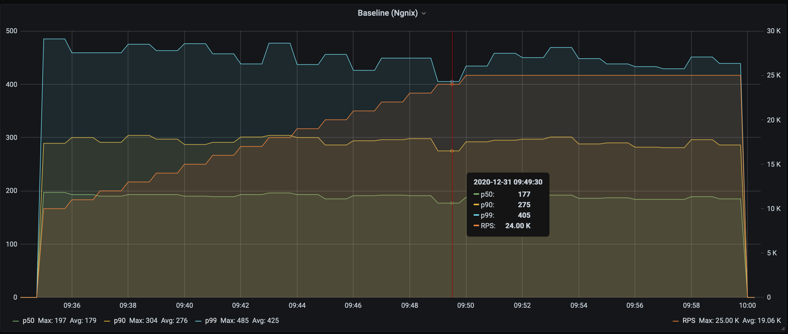

[](https://crates.io/crates/perf-gauge)


[](https://coveralls.io/github/xnuter/perf-gauge?branch=main)

Overview
========

Benchmarking tool for network services. Currently, limited to HTTP only (H1 or H2, over TCP or TLS).
However, it's easily extendable to other protocols.

It works in the following modes:

1. `ab`-like mode. Just send traffic to an endpoint for a given duration, or a number of requests. 
   1. Unlimited request rate (to find the max throughput).
   1. Choose the request rate and concurrency level.
   1. Measurements are down to `µs`.
1. Increase the request rate linearly, e.g. by `1,000` every minute to see how your service scales with load.
1. It can report metrics to `Prometheus` via a `pushgateway`.

For instance: .

Emitted metrics are:
* `request_count` - counter for all requests
* `success_count` - counter for only successful requests
* `bytes_count` - total bytes transferred
* `response_codes` - counters for response codes (200, 400, etc.)
* `success_latency` - latency histogram of successful requests only
* `error_latency` - latency histogram of failed requests (if any)
* `latency` - latency histogram across all requests
* `latency_{statistic}` - `{statistic} = {min, mean, max, stddev, p50, p90, p99, p99_9, p99_99, tm99, tm99.9, tm99.99}` - gauges for latency statistics

For instance, [benchmarking](https://github.com/xnuter/perf-gauge/wiki/Benchmarking-TCP-Proxies-written-in-different-languages:-C,-CPP,-Rust,-Golang,-Java,-Python) TCP proxies in different languages: C, C++, Rust, Golang, Java, Python.

Installation
======

For `MacOS`, `Ubuntu`, `Windows` you can use the binaries in the [release section](https://github.com/xnuter/perf-gauge/releases). 

Alternatively you can build it on your machine:

Install cargo - follow these [instructions](https://doc.rust-lang.org/cargo/getting-started/installation.html).

On Debian to fix [OpenSSL build issue](https://docs.rs/openssl/0.10.30/openssl/). E.g. on Debian:

```bash
sudo apt-get install pkg-config libssl-dev
```

on `Red-Hat`:
```bash
sudo dnf install pkg-config openssl-devel
# or
sudo yum install pkg-config openssl-devel
```

Then:
```
$ cargo install perf-gauage --features full
```

Supported features:

* `default` - if no features specified, only `http` traffic is supported
* `tls-native` - TLS support (based on `OpenSSL`)
* `tls-boring` - TLS support (based on `BoringSSL`). Doesn't support self-signed certs.
* `report-to-prometheus` - to support `Prometheus` for metric collection
* `full` - `report-to-prometheus` + `tls-native`
* `full-boring` - `report-to-prometheus` + `tls-boring`

Usage
=======
```bash
$ perf-gauge help 
```

```text
Gauging performance of network services. Snapshot or continuous, supports Prometheus metrics.

USAGE:
    perf-gauge [OPTIONS] <SUBCOMMAND>

OPTIONS:
    -c, --concurrency <CONCURRENCY>
            Concurrent clients. Default `1` [default: 1]

        --continuous
            If it's a part of a continuous run. In this case metrics are not reset at the end to
            avoid saw-like plots

    -d, --duration <DURATION>
            Duration of the test

    -h, --help
            Print help information

    -m, --max_iter <MAX_ITER>
            takes_value "The number of iterations with the max rate. By default `1` [default: 1]

    -n, --num_req <NUM_REQ>
            Number of requests per client

    -N, --name <NAME>
            Test case name. Optional. Can be used for tagging metrics

        --prometheus <PROMETHEUS>
            If you'd like to send metrics to Prometheus PushGateway, specify the server URL. E.g.
            10.0.0.1:9091

        --prometheus_job <PROMETHEUS_JOB>
            Prometheus Job (by default `pushgateway`)

    -r, --rate <RATE>
            Request rate per second. E.g. 100 or 0.1. By default no limit

        --rate_max <RATE_MAX>
            Max rate per second. Requires --rate-step

        --rate_step <RATE_STEP>
            Rate increase step (until it reaches --rate_max)
            
        --request_timeout <REQUEST_TIMEOUT>
           Timeout of a single request. E.g. "--request_timeout 30s". Timeouts are treated as fatal
           errors

    -V, --version
            Print version information

SUBCOMMANDS:
    help    Print this message or the help of the given subcommand(s)
    http    Run in HTTP(S) mode
```

Help for the `http` command:

```bash
$ perf-gauge help http
```
```text
Run in HTTP(S) mode

USAGE:
    perf-gauge http [OPTIONS] [TARGET]...

ARGS:
    <TARGET>...    Target, e.g. https://my-service.com:8443/8kb Can be multiple ones (with
                   random choice balancing)


OPTIONS:
    -B, --body <BODY>                Body of the request. Could be either `random://[0-9]+`,
                                     `file://$filename` or `base64://${valid_base64}`. Optional
        --conn_reuse                 If connections should be re-used
    -E, --error_stop <ERROR_STOP>    Stop immediately on error codes. E.g. `-E 401 -E 403`
    -h, --help                       Print help information
    -H, --header <HEADER>            Headers in \"Name:Value1\" form. Can be provided multiple
                                     times. It can contain multiple values, e.g.
                                     \"Name:Value1:Value2:Value3\". In this case a random one is
                                     chosen for each request
        --http2_only                 Enforce HTTP/2 only
        --ignore_cert                Allow self signed certificates
    -M, --method <METHOD>            Method. By default GET
    -V, --version                    Print version information

```

For example, test an endpoint using a single run, 5 seconds (max possible request rate):

```bash
$ perf-gauge --concurrency 10 \
               --duration 1m \
               http http://localhost/10kb --conn_reuse
```
  
Parameters:

* `--concurrency 10` - the number of clients generating load concurrently
* `--duration 1m` - step duration `1m` (or `10s`, `5m`, etc.)
* `http http://local-nginx.org/10kb --conn_reuse` - run in `http` mode to the given endpoint, reusing connections. 

Reporting performance metrics to Prometheus
===========================================

Another use case, is to increase request rate and see how the latency degrades. 

E.g. increase RPS each minute by 1,000: 

```bash
export PROMETHEUS_HOST=10.138.0.2

$ perf-gauge --concurrency 10 \
               --request_timeout 30s \
               --rate 1000 --rate_step 1000 --rate_max 25000 \
               --max_iter 15 \
               --duration 1m \
               --name nginx-direct \
               --prometheus $PROMETHEUS_HOST:9091 \
               http https://localhost/10kb --conn_reuse --ignore_cert
```

* `--concurrency 10` - the number of clients generating load concurrently
* `--request_timeout 30s` - do not wait for response longer than 30 seconds and stop execution on timeouts.
* `--rate 1000 --rate_step 1000 --rate_max 25000` - start with rate 1000 rps, then add 1000 rps after each step until it reaches 25k.
* `--duration 1m` - step duration `1m`
* `--max_iter 15` - perform `15` iterations at the max rate
* `--name nginx-direct` - the name of the test (used for reporting metrics to `prometheus`)
* `--prometheus $PROMETHEUS_HOST:9091` - push-gateway `host:port` to send metrics to Prometheus.
* `http http://local-nginx.org/10kb --conn_reuse` - run in `https` mode to the given endpoint, reusing connections and not checking the certificate. 
