- [Methodology](#methodology)
  * [Nginx configuration](#nginx-configuration)
  * [Setting up cpu-sets](#setting-up-cpu-sets)
  * [Prometheus](#prometheus)
- [Moderate TPS](#moderate-tps)
  * [Baseline](#baseline)
  * [HTTP Tunnel benchmark (in TCP mode)](#http-tunnel-benchmark--in-tcp-mode-)
  * [Tcp-proxy (Golang)](#tcp-proxy--golang-)
  * [Summary](#summary)
- [Tail latencies](#tail-latencies)
- [Highest TPS](#highest-tps)
- [Conclusion](#conclusion)

## Methodology

Using an 8-cores instance with the following CPU-sets to isolate components, but at the same time to avoid rule out network delays/noise:

* Cores 0-1: Nginx (serves `10kb` of payload per request)
* Cores 2-3: HTTP proxy (either HTTP Tunnel or Chisel)
* Cores 4-7: [perf-gauge](https://github.com/xnuter/perf-gauge) - the generator of load.

### Nginx configuration

```
worker_processes 2;
worker_cpu_affinity 00000001 00000010;
keepalive_requests 50;
```

Please note the `keepalive_requests` setting. We force reconnection every 50 requests, so `p99` would capture the connection establishment latency.
So each connection will serve `500kb` of data (`50 req * 10kb payload`).

### Setting up cpu-sets

Install the Linux package:
```
apt-get install cgroup-tools
```

Then create a CPU set for the benchmarking tool:
```
sudo cgcreate -t $USER:$USER -a $USER:$USER  -g cpuset:perfgauge
echo 4-7 > /sys/fs/cgroup/cpuset/perfgauge/cpuset.cpus
echo 0 > /sys/fs/cgroup/cpuset/perfgauge/cpuset.mems
```

### Prometheus

`perf-gauge` can emit metrics to `Prometheus.` To launch a stack, you can use https://github.com/xnuter/prom-stack
I just forked `prom-stack` and removed anything but `prometheus,` `push-gateway` and `grafana.` You can clone the stack and launch `make.`

Then set the variable with the host, for instance:

```
export PROMETHEUS_HOST=10.138.0.2
```

## Moderate TPS

For starters, let's benchmark `http-tunnel-rust` and `tcp-proxy-golang` under moderate load. Starting from `1000 RPS` going all the way up to `25,000 RPS`,
adding `1000 RPS` every minute.  

### Baseline 

First of all, let's see how much load can be generated directly to `nginx` and what the latency numbers are.

```
cgexec -g cpuset:perfgauge --sticky \
        perf-gauge \
             --concurrency 10 \
             --rate 1000 --rate_step 1000 --rate_max 25000 \
             --max_iter 15 \
             --duration 60s \
             --name nginx-direct \
             --prometheus $PROMETHEUS_HOST:9091 \
             http http://localhost/10kb --conn_reuse
```

Let me explain the parameters:

* `--concurrency 10` - the number of clients generating load concurrently
* `--rate 1000 --rate_step 1000 --rate_max 25000` - start with rate 1000 rps, then add 1000 rps after each step until it reaches 25k.
* `--duration 60s` - step duration `60s`
* `--max_iter 15` - perform `15` iterations at the max rate
* `--name nginx-direct` - the name of the test (used for reporting metrics to `prometheus`)
* `--prometheus $PROMETHEUS_HOST:9091` - push-gateway `host:port` to send metrics to Prometheus.
* `http http://local-nginx.org/10kb --conn_reuse` - run in `http` mode to the given endpoint, reusing connections. 

Please note that we do not benchmark `https` as we're benchmarking TCP proxies, and using `https` would only add noise. 

Which prints something like this:

```
Test: nginx-direct
Duration 60.020547823s
Requests: 1499937
Request rate: 24990.392 per second
Success rate: 100.000%
Total bytes: 15.0 GB
Bitrate: 1999.231 Mbps

Summary:
200 OK: 1499937

Latency:
Min    :   54µs
p50    :  187µs
p90    :  290µs
p99    :  465µs
p99.9  :  752µs
p99.99 :  996µs
Max    : 2284µs
Mean   :  201µs
StdDev :   78µs
```

In Grafana, we can see that the latency is stable for low and high TPS:

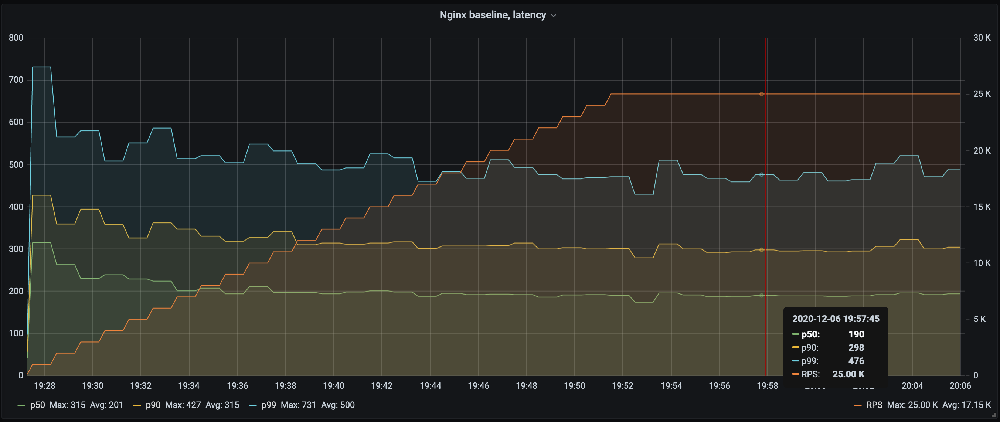

Let me briefly explain the graph:

* RPS (on the right) goes up from 1000 rps to ~25k
* On the left, you can see how `p50`, `p90`, and `p99` change with the request rate.

Okay, let's now see how placing a proxy between `perf-gauge` and `nginx` would affect latency and throughput.

We can see here that the latencies are stable and don't change with the load much.
We can see that the highest `p99` is the first minute, which can be explained by the client initialization stage (creating a connection pool).
   
### HTTP Tunnel benchmark (in TCP mode)

Let's launch the [http-tunnel](https://github.com/xnuter/http-tunnel) (using only cores #2 and #3) in the `tcp` mode proxying traffic to `nginx`:

```
sudo cgcreate -t $USER:$USER -a $USER:$USER  -g cpuset:httptunnel
echo 2-3 > /sys/fs/cgroup/cpuset/httptunnel/cpuset.cpus
echo 0 > /sys/fs/cgroup/cpuset/httptunnel/cpuset.mems

cgexec -g cpuset:httptunnel --sticky http-tunnel --bind 0.0.0.0:8080 tcp --destination localhost:80
```

Let's benchmark it with `perf-gauge`:

```
cgexec -g cpuset:perfgauge --sticky \
        perf-gauge \
             --concurrency 10 \
             --rate 1000 --rate_step 1000 --rate_max 25000 \
             --max_iter 15 \
             --duration 60s \
             --name http-tunnel-rust \
             --prometheus $PROMETHEUS_HOST:9091 \
             http http://localhost:8080/10kb --conn_reuse
```
The console output would be something like this:
```
Test: http-tunnel-rust
Duration 60.022563686s
Requests: 1499890
Request rate: 24988.769 per second
Success rate: 100.000%
Total bytes: 15.0 GB
Bitrate: 1999.102 Mbps

Summary:
200 OK: 1499890

Latency:
Min    :  106µs
p50    :  263µs
p90    :  448µs
p99    :  800µs
p99.9  : 1229µs
p99.99 : 1723µs
Max    : 7898µs
Mean   :  301µs
StdDev :  130µs
```

We can see it added several tens of microseconds on top of the baseline latency:


Or, comparing both side by side (Nginx is on the left, Http-Tunnel is on the right):

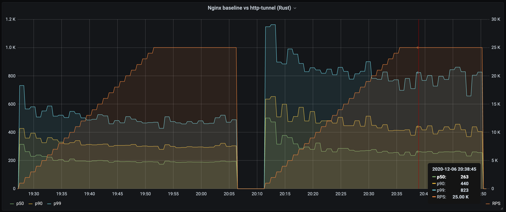

### Tcp-proxy (Golang)

Let's compare the performance with [tcp-proxy](https://github.com/jpillora/go-tcp-proxy) written in Golang:  

```
sudo cgcreate -t $USER:$USER -a $USER:$USER  -g cpuset:tcpproxy
echo 2-3 > /sys/fs/cgroup/cpuset/tcpproxy/cpuset.cpus
echo 0 > /sys/fs/cgroup/cpuset/tcpproxy/cpuset.mems

cgexec -g cpuset:tcpproxy --sticky ./tcp-proxy -l localhost:8111 -r localhost:80 > /dev/null
```
```
cgexec -g cpuset:perfgauge --sticky \
        perf-gauge \
             --concurrency 10 \
             --rate 1000 --rate_step 1000 --rate_max 25000 \
             --max_iter 15 \
             --duration 60s \
             --name tcp-proxy-golang \
             --prometheus $PROMETHEUS_HOST:9091 \
             http http://localhost:8111/10kb --conn_reuse
```
The console output would be something like this:

```
Test: tcp-proxy-golang
Duration 60.020734565s
Requests: 1499900
Request rate: 24989.697 per second
Success rate: 100.000%
Total bytes: 15.0 GB
Bitrate: 1999.176 Mbps

Summary:
200 OK: 1499900

Latency:
Min    :    98µs
p50    :   272µs
p90    :   449µs
p99    :  1221µs
p99.9  :  3513µs
p99.99 :  5764µs
Max    : 35881µs
Mean   :   322µs
StdDev :   295µs
```

It seems that `p99` went up tangibly:


Or, comparing side by side with http-tunnel (Http-Tunnel-Rust is on the left, Tcp-Proxy-Golang is on the right):

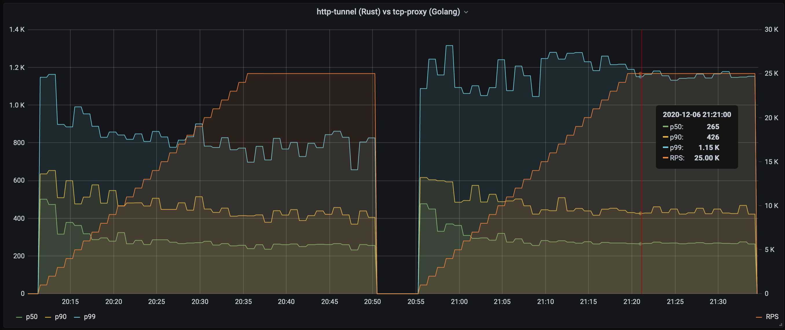

### Summary

Both Http-Tunnel (Rust) and Tcp-Proxy (Golang) add about `80µs` to the `p50` and `~150µs` to the `p90`.
However, at for the `p99` while the Rust based proxy adds `~330µs` the Golang based one adds `~650µs`:

| | p50  | p90  | p99 | 
|---|---|---|---|
| Baseline Nginx  |  201µs | 315µs | 500µs  |
| Http-Tunnel (Rust) |  283µs | 463µs | 831µs |
| Chisel (Golang) | 289µs  | 468µs | 1160µs  |

Side by side with http-tunnel (Http-Tunnel-Rust is on the left, Tcp-Proxy-Golang is on the right):
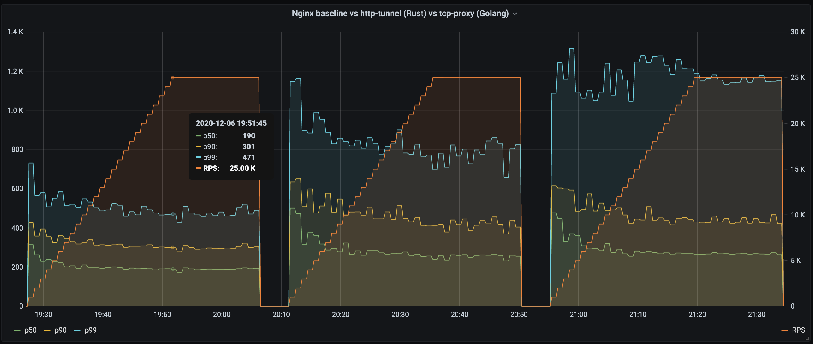

Let's look at the tail latencies deeper. 

## Tail latencies

Tail latencies we're going to compare are `p99`, 'p99.9' and 'p99.99'.
Which are the lower boundaries for the worst `1%`, `0.1%` and `0.01%` respectively.

Let's first take a look at the Nginx baseline:

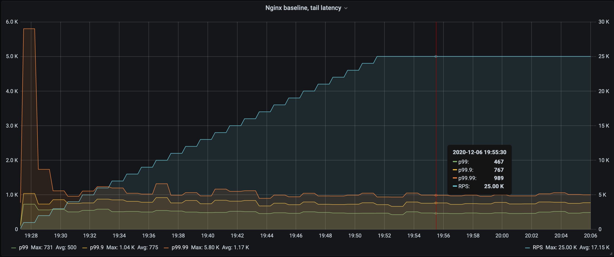

As we can see the first minute `p99.99` is about `6ms`, but it includes connection pool initialization.
After that all three are quite stable and low. At least it means that both the server and the benchmarking client have very predictable performance. 
That's good!

What about `http-tunnel (Rust)`?

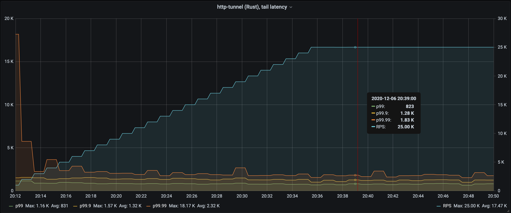

Now the pool initialization yielded `18ms` but after that the latency overhead on top of Nginx was quite manageable and stable too.

It's time to compare it to `tcp-proxy (Golang)`

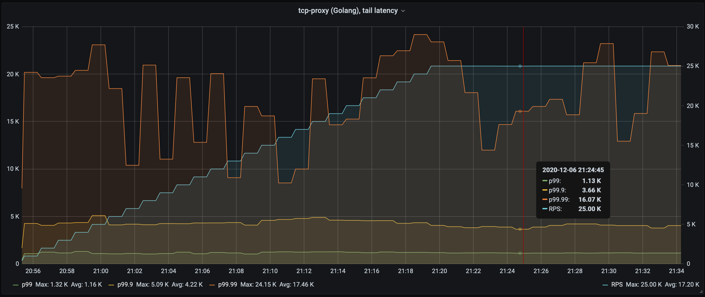    

Well, it's a bit different picture. While `p99` and `p99.9` are also stable, but they have a tangible latency surplus.
As the `p99.99` is oscillating and quite high:

| | p99  | p99.9  | p99.99 | 
|---|---|---|---|
| Baseline Nginx  |  500µs | 775µs | 1,170µs  |
| Http-Tunnel (Rust) |  831µs | 1,320µs | 2,320µs |
| Chisel (Golang) | 1,160µs  | 4,220µs | 17,460µs  | 

Or, comparing `p99.9` and `p99.99` side by side (`nginx baseline`, `http-tunnel-rust`, `tcp-proxy-golang`):

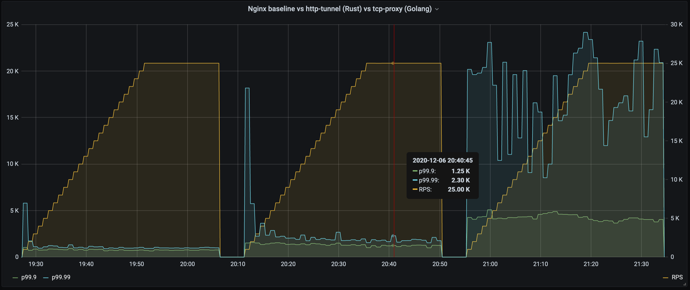

## Highest TPS

Okay, let's know evaluate service's bandwidth. For that we can run the following command:

```
cgexec -g cpuset:perfgauge --sticky \
        perf-gauge \
             --concurrency 100 \
             --max_iter 15 \
             --duration 60s \
             --name nginx-direct \
             --prometheus $PROMETHEUS_HOST:9091 \
             http http://localhost/10kb --conn_reuse
```

What's the difference with the command above? 

* `--concurrency 100` - we created `100` concurrent clients to open more connections
* no `rate` parameters, which is interpreted as "send as many requests as possible"

So it will send as many requests as possible until the backend saturates.

First, let's compare throughput. Baseline Nginx goes up to `60k RPS` (`4.8 Gbps`) (not bad just for 2 cores),
`http-tunnel-rust` stops at `43k RPS` (`3.44 Gbps`), `tcp-proxy-golang` reached `38k RPS` (`30.4 Gbps`): 

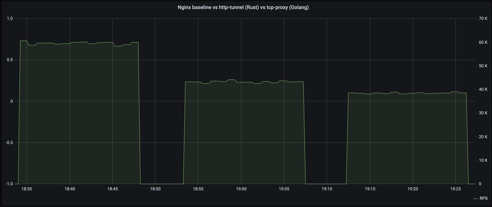

The `p99` latency surplus is the largest for the `tcp-proxy-golang`:

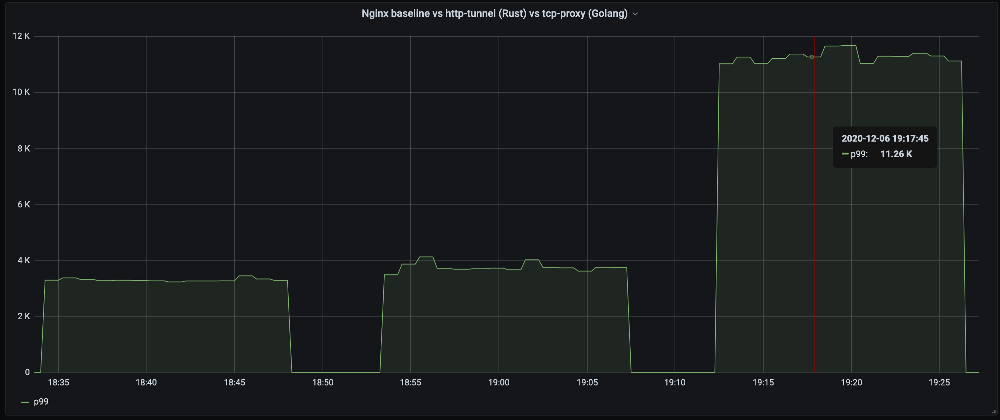

And the same for the tail latencies:

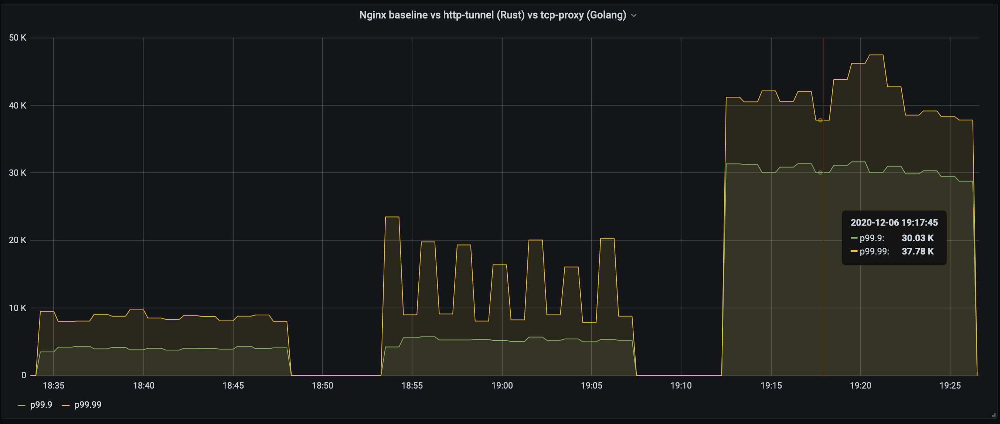

## Conclusion

While Rust-based and Golang-based proxies are comparable at `p50` and `p90` level for moderate TPS,
the Rust-based one has better tail latencies, especially under stress.  