- [Max TPS](#max-tps)
    * [High-performance (C, C++, Rust)](#high-performance--c--c----rust-)
        + [Maximum rate achieved](#maximum-rate-achieved)
        + [Regular percentiles (p50,90,99)](#regular-percentiles--p50-90-99-)
        + [Tail latency (p99.9 and p99.99)](#tail-latency--p999-and-p9999-)
        + [Trimmed mean and standard deviation](#trimmed-mean-and-standard-deviation)
        + [CPU consumption](#cpu-consumption)
        + [Summary](#summary)
    * [Memory-safe languages (Rust, Golang, Java, Python)](#memory-safe-languages--rust--golang--java--python-)
        + [Maximum rate achieved](#maximum-rate-achieved-1)
        + [Regular percentiles (p50,90,99)](#regular-percentiles--p50-90-99--1)
        + [Tail latency (p99.9 and p99.99)](#tail-latency--p999-and-p9999--1)
        + [Trimmed mean and standard deviation](#trimmed-mean-and-standard-deviation-1)
        + [CPU consumption](#cpu-consumption-1)
        + [Summary](#summary-1)
    * [Total summary](#total-summary)
    * [Conclusion](#conclusion)

<small><i><a href='http://ecotrust-canada.github.io/markdown-toc/'>Table of contents generated with markdown-toc</a></i></small>

### Max TPS

The load is generated without any rate limiting with the concurrency setting `100`.

#### High-performance (C, C++, Rust)

##### Maximum rate achieved

The most interesting question, is how much RPS each solution can handle?

While Nginx is capable of handling `~60k` requests per second (impressive for just two cores!),
all three C/C++/Rust are somewhat comparable (but C++ handled slightly more requests):

* C - 45k
* C++ - 48.8k
* Rust - 46k

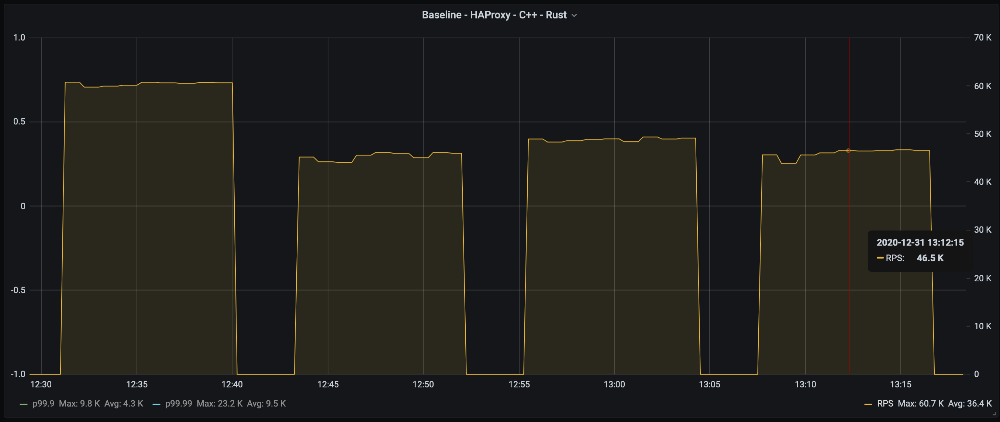

##### Regular percentiles (p50,90,99)

The results are somewhat mixed again. While C++ showed better `p50`, it's `p99` is worse.
At the `p90` level all three are close:

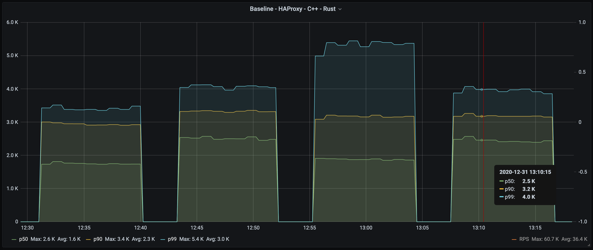

##### Tail latency (p99.9 and p99.99)

For the tail latency, Rust is better than both C and C++:

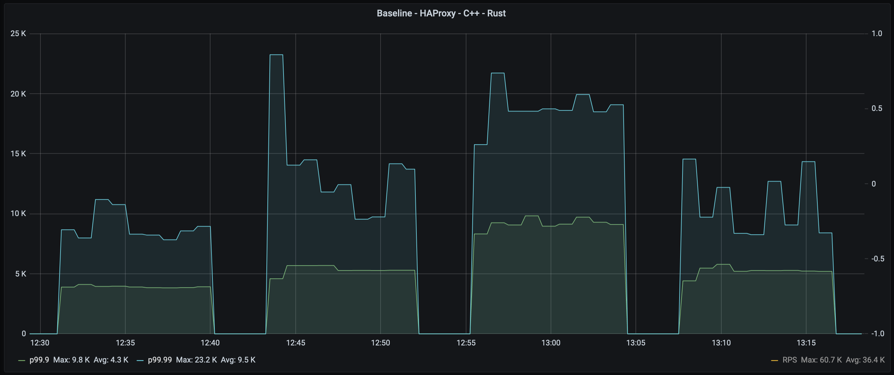

##### Trimmed mean and standard deviation

All three are nearly identical, however C++ is a tiny bit better (see the table below for the numbers):

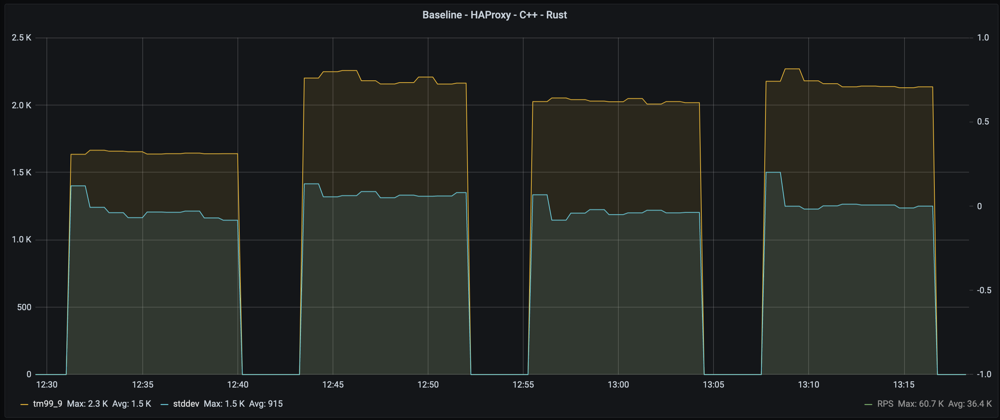

##### CPU consumption

CPU utilization is important here. What we want, is to saturate the CPU as much as we can.

Baseline CPU Utilization is 73%, but in fact it is 93% of available cores (as cores 2 and 3 were not used).

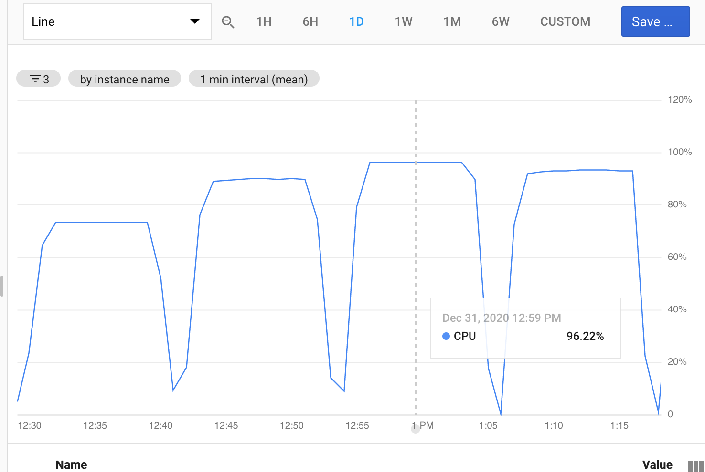

| | CPU Utilization |
|---|---|
|Baseline |97% |
|C |90%|
|C++ |96%|
|Rust |93%|

Which means that C++ managed to use more CPU and spent more time handling requests.
However, it's worth mentioning that the `draft-http-tunnel` is implemented using callbacks, while the Rust solution is based on `tokio`,
which is a feature-rich framework and is much more flexible and extendable.

##### Summary

| | p50  | p90  | p99 |  p99.9 |  p99.99 | max | tm99 | stddev | rps (k) |
|---|---|---|---|---|---|---|---|---|---|
| Baseline  | 1.8  | 2.9 | 3.4 | 3.9 | 9.0 | 202.6 | 1.6 | 1.2 | 60.4 |
| C (HAProxy) | 2.5  | 3.3 | 4.1 | 5.4 | 13.4 | 191.2 | 2.2 | 1.3 | 45.3 |
| C++ (draft-http-tunnel) | 1.9  | 3.2 | 5.3 | 9.2 | 18.9 | 205.4 | 2.0 | 1.2 | 48.8 |
| Rust (http-tunnel) | 2.4  | 3.2  | 3.9 | 5.2 | 10.8 | 202.5 | 2.2 | 1.3 | 46 |

#### Memory-safe languages (Rust, Golang, Java, Python)

##### Maximum rate achieved

Among memory safe both Rust and Golang showed comparable throughput, while Java and Python were significantly behind:

* Rust - 46k
* Golang - 42.6k
* Java - 25.9k
* Python - 18.3k

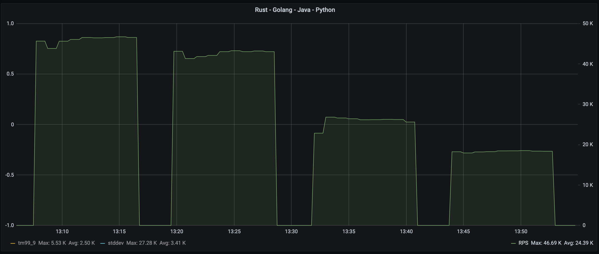

##### Regular percentiles (p50,90,99)

Again, we can see, that at `p50`-`p90` level Golang is somewhat comparable to Rust,
but quickly deviates at `p99` level, adding almost two milliseconds.

Java and Python exhibit substantially higher latencies, but Java `p99` latency is much worse than Python:

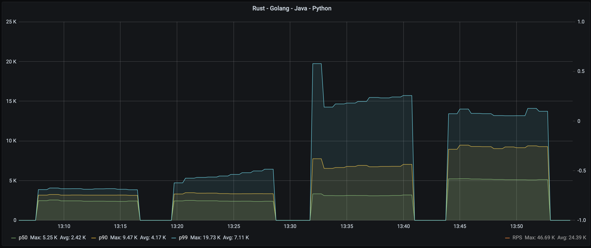

##### Tail latency (p99.9 and p99.99)

Tail latency shows even larger difference with Rust, and for Java is the worst of all four:

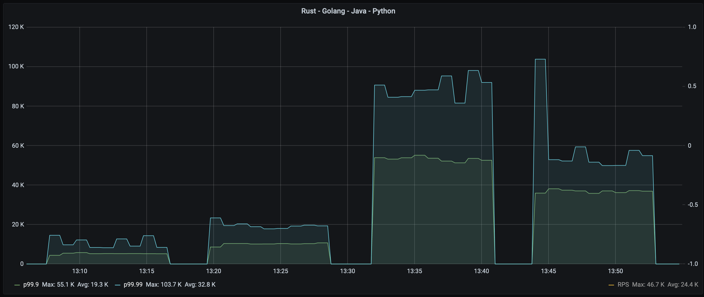

##### Trimmed mean and standard deviation

Golang's is comparable to Rust, which is impressive.  
Again, Java and Python are well behind both Rust and Golang:

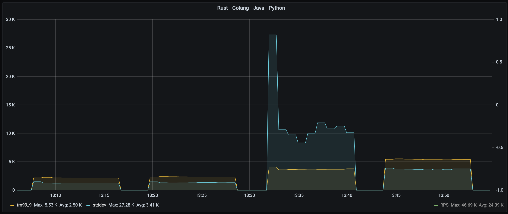

##### CPU consumption

CPU utilization is important here. What we want, is to saturate the CPU as much as we can.

As we can see, Rust does the best job of utilizing resources while Golang, Java and Python (in this order) 
allow more power to stay idle.

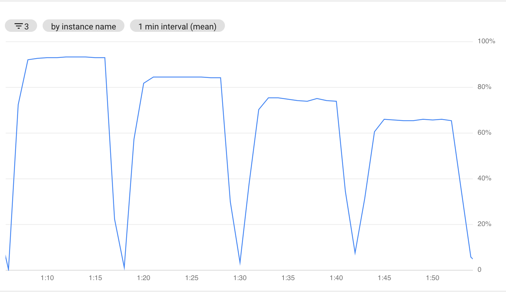

| | CPU Utilization |
|---|---|
|Rust |93%|
|Golang |84% |
|Java |74%|
|Python |65%|

##### Summary

| | p50  | p90  | p99 |  p99.9 |  p99.99 | max | tm99 | stddev | rps (k) |
|---|---|---|---|---|---|---|---|---|---|
| Rust (http-tunnel) | 2.4  | 3.2  | 3.9 | 5.2 | 10.8 | 202.5 | 2.2 | 1.3 | 46 |
| Tcp-Proxy (Golang) | 2.4 | 3.4 | 5.7  | 10.1 | 19.6 | 206.6 | 2.3 | 1.4 | 42.6 |
| NetCrusher (Java) | 3.1  | 6.9 | 15.6  | 53.2 | 89.1 | 2,850 | 3.7 | 12.3 | 25.9 |
| pproxy (Python) | 5.2  | 9.2 | 13.5  | 36.8 | 59.2 | 242.7 | 5.4 | 3.7 | 18.3 |

#### Total summary

| | p50  | p90  | p99 |  p99.9 |  p99.99 | max | tm99 | stddev | rps (k) |
|---|---|---|---|---|---|---|---|---|---|
| Baseline  | 1.8  | 2.9 | 3.4 | 3.9 | 9.0 | 202.6 | 1.6 | 1.2 | 60.4 |
| C (HAProxy) | 2.5  | 3.3 | 4.1 | 5.4 | 13.4 | 191.2 | 2.2 | 1.3 | 45.3 |
| C++ (draft-http-tunnel) | 1.9  | 3.2 | 5.3 | 9.2 | 18.9 | 205.4 | 2.0 | 1.2 | 48.8 |
| Rust (http-tunnel) | 2.4  | 3.2  | 3.9 | 5.2 | 10.8 | 202.5 | 2.2 | 1.3 | 46 |
| Tcp-Proxy (Golang) | 2.4 | 3.4 | 5.7  | 10.1 | 19.6 | 206.6 | 2.3 | 1.4 | 42.6 |
| NetCrusher (Java) | 3.1  | 6.9 | 15.6  | 53.2 | 89.1 | 2,850 | 3.7 | 12.3 | 25.9 |
| pproxy (Python) | 5.2  | 9.2 | 13.5  | 36.8 | 59.2 | 242.7 | 5.4 | 3.7 | 18.3 |

#### Conclusion

The Rust solution is on par with C/C++ solutions at all levels.
Golang is slightly worse, especially for tail latencies, but is close to high performance languages.

NetCrusher and pproxy have much worse throughput and latency characteristics if a network service is under heavy load.
But, NetCrusher (Java) showed the worst max latency measured in seconds:

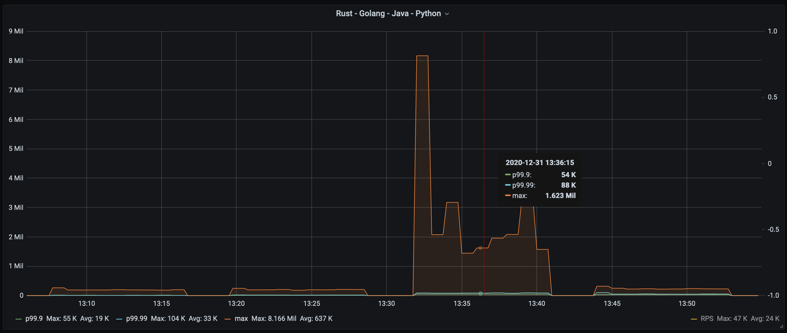

BTW, try to guess Java on the memory consumption graph:

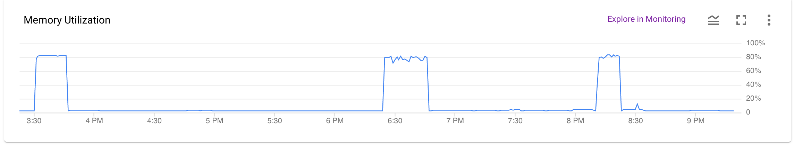
