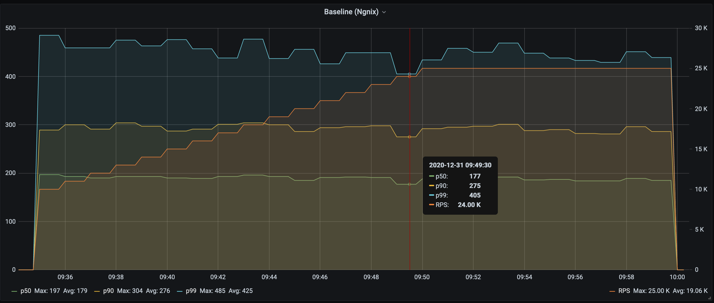

### Running perf-gauge

First, we allocate a cpu-set for `perf-gauge`:

```
sudo cgcreate -t $USER:$USER -a $USER:$USER  -g cpuset:perfgauge
echo 4-7 > /sys/fs/cgroup/cpuset/perfgauge/cpuset.cpus
echo 0 > /sys/fs/cgroup/cpuset/perfgauge/cpuset.mems
```

Then we can run it in different modes.

### Variables

For each test-case we'll use the following parameters:

```bash
PROMETHEUS_HOST=10.138.0.2 # depending on your setup
TEST_CASE=# of one Baseline, HAProxy, C++, Rust, Golang, Java, Python
ENDPOINTS=http://localhost/10kb # for Java/Python it would be two endpoints, e.g.
# ENDPOINTS=http://localhost:8000/10kb http://localhost:8001/10kb
MODERATE_TPS=25000 # or a smaller number for Java and Python
```

### Moderate TPS

We can use the following command to benchmark a TCP proxy in this mode:

```bash
echo "$(date): ${TEST_CASE}"

cgexec -g cpuset:perfgauge --sticky \
  perf-gauge \
      --concurrency 10 \
      --rate 10000 --rate_step 1000 --rate_max ${MODERATE_TPS} \
      --max_iter 10 \
      --duration 60s \
      --name bench-tcp-proxies \
      --prometheus ${PROMETHEUS_HOST}:9091 \
      http ${ENDPOINTS} --conn_reuse
```

The explanation of the parameters:

* `--concurrency 10` - the number of clients generating load concurrently
* `--rate 1000 --rate_step 1000 --rate_max 25000` - start with rate 1000 rps, then add 1000 rps after each step until it reaches 25k.
* `--duration 60s` - step duration `60s`
* `--max_iter 15` - perform `15` iterations at the max rate
* `--name bench-tcp-proxies` - the name of the test (used for reporting metrics to `prometheus`)
* `--prometheus $PROMETHEUS_HOST:9091` - push-gateway `host:port` to send metrics to Prometheus.
* `http ${ENDPOINTS} --conn_reuse` - run in `http` mode to the given endpoint, reusing connections.

Please note that we do not benchmark `https` as we're benchmarking TCP proxies, and using `https` would only add noise.

The data is sent to Prometheus every minute (latency in `µs` is on the left, the rate is on the right):



As you can see the latency variance is quite small for regular percentiles (`p50`, `p90`, `p99`).
However, it's quite stable even for tail latencies:


### Max TPS

Almost the same, but without specifying the rate and with a higher concurrency level:

```bash
cgexec -g cpuset:perfgauge --sticky \
  perf-gauge \
      --concurrency 100 \
      --max_iter 10 \
      --duration 60s \
      --name bench-tcp-proxies \
      --prometheus $PROMETHEUS_HOST:9091 \
      http ${ENDPOINTS} --conn_reuse
```

### No keep-alive

The only difference with Moderate TPS is a lower rate and no `--conn_reuse` parameter:

```bash
cgexec -g cpuset:perfgauge --sticky \
  perf-gauge \
      --concurrency 10 \
      --rate 500 --rate_step 500 --rate_max 3500 \
      --max_iter 10 \
      --duration 60s \
      --name bench-tcp-proxies \
      --prometheus $PROMETHEUS_HOST:9091 \
      http ${ENDPOINTS}
  ```